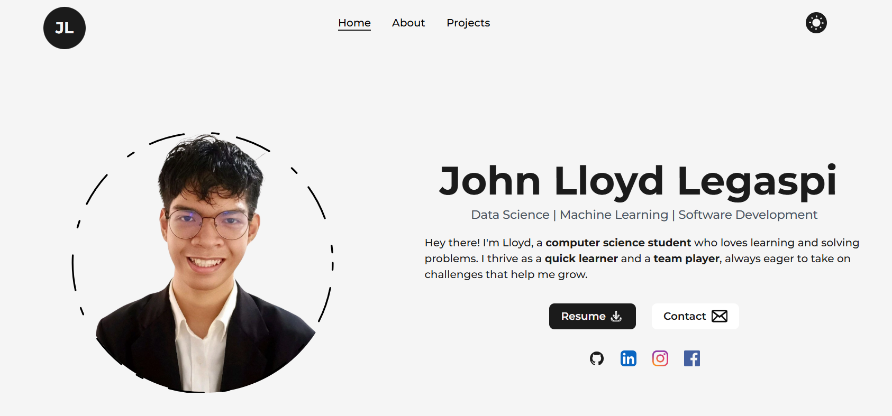

# Portfolio Website

A modern, responsive portfolio website built with Next.js, React, and Tailwind CSS to showcase professional skills, projects, and experience.



## 🌟 Features

- **Responsive Design**: Optimized for all screen sizes from mobile to desktop
- **Dark/Light Mode**: Toggle between dark and light themes
- **Smooth Animations**: Page transitions and UI animations using Framer Motion
- **Interactive UI Components**: Dynamic and engaging user interface elements
- **Multiple Sections**:
  - **Home**: Introduction and social links
  - **About**: Personal background and technologies
  - **Projects**: Showcase of development work
  - **Experience**: Professional work history
  - **Education**: Academic background

## 🛠️ Technologies Used

- **Frontend Framework**: Next.js with React
- **Styling**: Tailwind CSS
- **Animations**: Framer Motion
- **Typography**: Google Fonts (Montserrat)
- **Icons**: Custom SVG components
- **Deployment**: [Deployment platform]

## 🚀 Getting Started

### Prerequisites

- Node.js (v14.0.0 or later)
- npm or yarn

### Installation

1. Clone the repository:
   ```bash
   git clone https://github.com/lloydlegaspi/Portfolio-Website.git
   cd Portfolio-Website
   ```

2. Install dependencies:
   ```bash
   npm install
   # or
   yarn install
   ```

3. Run the development server:
   ```bash
   npm run dev
   # or
   yarn dev
   ```

4. Open [http://localhost:3000](http://localhost:3000) in your browser to see the result.

## 📁 Project Structure

```
Portfolio-Website/
├── public/
│   ├── images/           # Project and profile images
│   ├── All-Texts/        # Text content and resources
│   └── favicon.ico
├── src/
│   ├── components/       # Reusable UI components
│   ├── pages/            # Next.js page components
│   └── styles/           # CSS and styling files
├── package.json
└── README.md
```

## 🔧 Customization

To use this portfolio template for yourself:

1. Update personal information in the relevant components
2. Replace project images and descriptions in the projects directory
3. Modify skills and technologies in `Technologies.js`
4. Update experience and education details in their respective components

## 🔍 Resources Used

- Fonts from Google Fonts
- Icons from Iconify

## 🙏 Acknowledgments

- Original design and development by CodeBucks

---

Made with ❤️ by John Lloyd Legaspi


