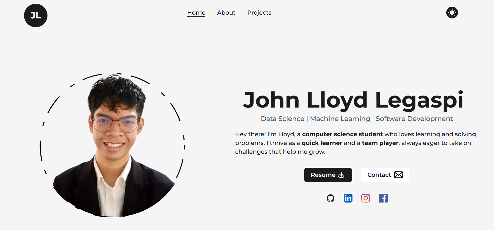

# John Lloyd Legaspi — Portfolio

A production-oriented personal portfolio for John Lloyd S. Legaspi. It presents selected software, machine-learning, and data work; professional experience and education; verified credentials; direct contact options; and an optional Gemini-powered assistant grounded in the same canonical content shown by the interface.

[View the deployed portfolio](https://lloyd-legaspi-portfolio.vercel.app/)



## Architecture

The site uses Next.js 16.3, React 19, strict TypeScript, the App Router, and Tailwind CSS. Server Components render static portfolio content by default; focused Client Components own theme state, project filters, accessible dialogs, the email form, and the chat interface.

Portfolio facts live in typed modules under `src/content/`. Pages and the chatbot context import those modules so professional information is not duplicated in UI components or synchronously read from JSON on each request.

```text
src/
├── app/                 # App Router pages, metadata, SEO files, and API route
├── components/          # Feature-grouped UI components
├── content/             # Canonical typed portfolio facts
├── lib/                 # Validation, project utilities, and Gemini provider
├── test/                # Shared test setup
└── types/               # Reusable domain types
e2e/                     # Playwright smoke flows
docs/                    # Operational notes
```

## Requirements

- Node.js 24 LTS (see `.nvmrc`)
- npm 11 or newer
- A Gemini API key only if the portfolio assistant will be enabled

## Local development

```bash
npm ci
Copy-Item .env.example .env.local
npm run dev
```

Open [http://localhost:3000](http://localhost:3000). On non-PowerShell systems, copy `.env.example` to `.env.local` with the equivalent shell command.

## Environment variables

| Variable               | Visibility  | Purpose                                                                                  |
| ---------------------- | ----------- | ---------------------------------------------------------------------------------------- |
| `GEMINI_API_KEY`       | Server only | Authenticates Gemini requests.                                                           |
| `GEMINI_MODEL`         | Server only | Selects the production Gemini model.                                                     |
| `NEXT_PUBLIC_SITE_URL` | Public      | Sets the canonical production origin for metadata, robots, sitemap, and structured data. |

Never expose the Gemini key through a `NEXT_PUBLIC_` variable or commit `.env.local`. If Gemini configuration is absent, the rest of the portfolio remains functional and the chat route returns a generic unavailable response.

## Quality gates

```bash
npm run lint
npm run format:check
npm run typecheck
npm test
npm run test:coverage
npm run build
npm run test:e2e
```

Playwright needs a browser once per machine:

```bash
npx playwright install chromium
```

GitHub Actions runs linting, formatting, type checking, unit/component tests, a production build, and a Chromium smoke flow for pushes to `main` and pull requests.

## Chat security and operations

`POST /api/chat` accepts only JSON with a non-empty `message` of at most 1,000 characters. Provider errors, configuration details, and stack traces are never returned to the browser; model requests are cancelled after a bounded timeout; responses render as text rather than raw HTML.

Serverless rate limiting must be distributed. See [docs/rate-limiting.md](docs/rate-limiting.md) before enabling chat for substantial public traffic.

## Deployment

1. Run every quality gate locally.
2. Configure the three environment variables in the hosting platform.
3. Deploy with `npm run build` and `npm run start`, or connect the repository to a compatible Next.js host.
4. Confirm that `NEXT_PUBLIC_SITE_URL` is the exact public origin and that `/robots.txt` and `/sitemap.xml` use it.

## Content maintenance

Edit only the relevant module in `src/content/`, preserve ISO dates, and run the validation tests. Do not guess professional facts.

## Engineering documentation

- [Repository guidance for contributors and coding agents](AGENTS.md)
- [Chat rate-limiting guidance](docs/rate-limiting.md)

## Attribution

The portfolio retains the existing visual direction and assets. The original design inspiration is credited to CodeBucks; subsequent implementation and content are by John Lloyd Legaspi.
